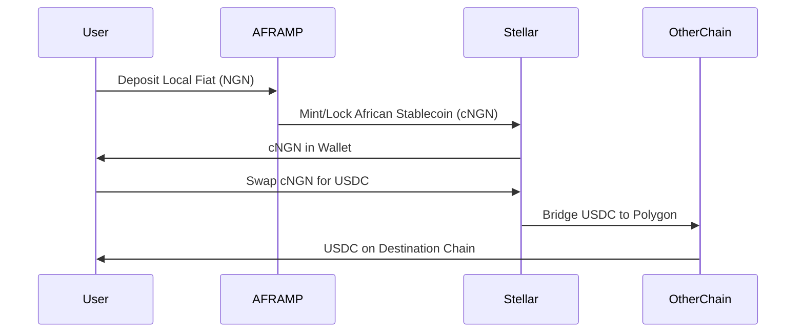
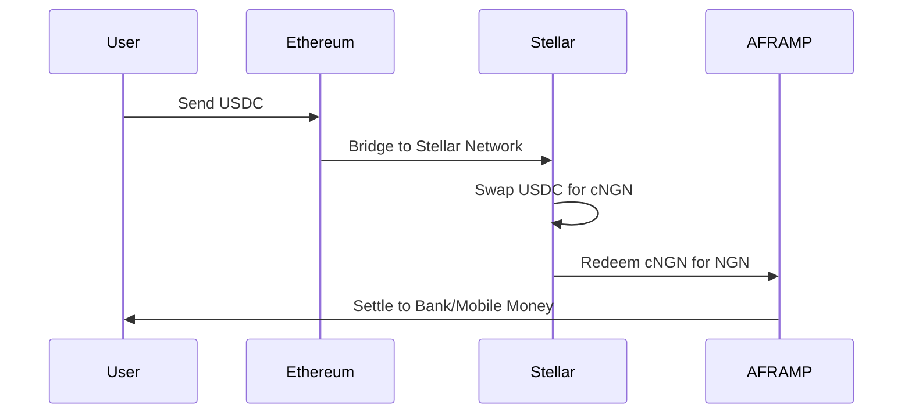
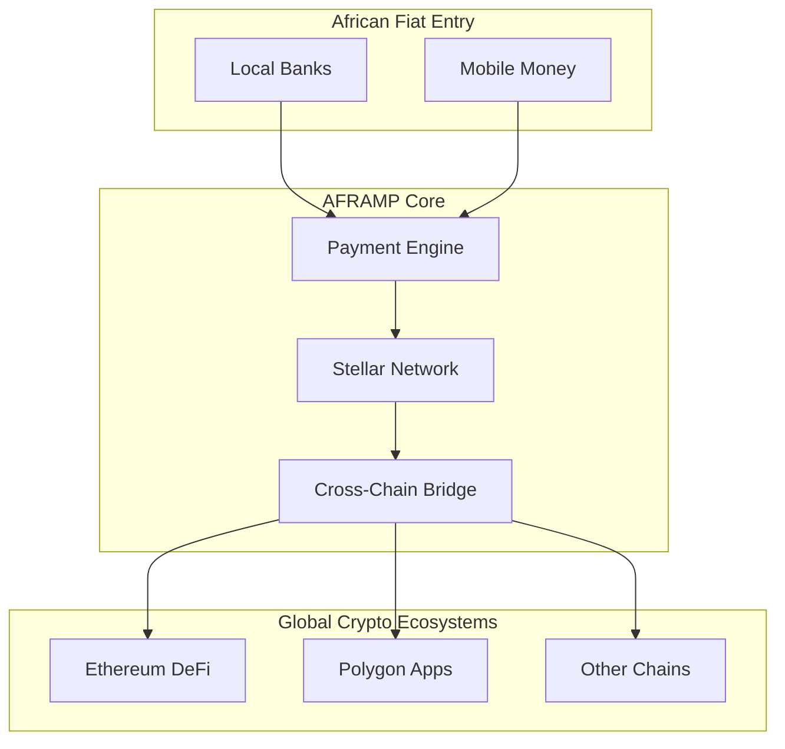

# 🌍 AFRAMP: Africa's Financial Bridge

## Don't Trust, Verify

AFRAMP is a blockchain payment platform designed specifically for the African market, enabling seamless **onramp** (local currency to crypto) and **offramp** (crypto to local currency) transactions using African stablecoins. Built on **Stellar** with multi-chain compatibility, we provide instant, low-cost access to global digital assets while solving local problems like cross-border payments and bill settlements.

## 🌍 The Problem

Financial mobility in Africa is hindered by fragmented and expensive systems.

### Traditional finance and crypto access in Africa suffer from:

❌ **High Cost** – Exorbitant fees for cross-border transfers and currency conversions

❌ **Limited Access** – Difficult entry to global crypto markets; complex onramps

❌ **Slow Settlement** – International payments can take days to clear

❌ **Unified Bills** – No single platform to pay diverse Pan-African utilities and services

❌ **Volatility Risk** – Lack of accessible, local-currency-pegged digital assets

## 🌟 The AFRAMP Solution

AFRAMP builds a unified bridge between African fiat economies and global blockchain ecosystems.

### Key innovations:

✅ **Local Stablecoin Gateways** – Direct on/off ramps using cNGN, eZAR, and other African stablecoins

✅ **Stellar-First Speed** – Near-instant, low-cost transactions on the Stellar network

✅ **Multi-Chain Access** – Convert and move assets across Ethereum, Polygon, and more

✅ **Pan-African Bill Payments** – Settle utilities, airtime, and services across borders from one wallet

✅ **Transparent by Design** – Every transaction is verifiable on-chain; "Don't Trust, Verify" is built-in

## 🎯 Who Is AFRAMP For?

*   **African Consumers & Diaspora** – Send remittances, pay bills, and manage finances seamlessly
*   **Freelancers & Remote Workers** – Receive global payments and convert to local currency instantly
*   **SMEs & Exporters** – Conduct cross-border trade with minimal fees and friction
*   **Crypto Users in Africa** – Easy entry/exit to digital asset markets using local currency
*   **Developers & Projects** – Integrate Pan-African payment rails into dApps and services

## 🧠 Core Value Proposition

**Access global finance through African stablecoins. Move value across chains in seconds. Verify every transaction on the ledger.**

## 🔄 Two Core Transaction Flows

### ⬇️ Mode 1: Onramp (Fiat to Crypto)

#### Flow:
1.  User deposits local currency (NGN, KES, GHS) via bank or mobile money
2.  Funds convert to African stablecoin (e.g., cNGN) on Stellar
3.  Stablecoin can be held, sent, or swapped to other assets (USDC, XLM)
4.  Assets can be bridged to other supported chains (Ethereum, Polygon)

#### Mermaid: Onramp Flow


### ⬆️ Mode 2: Offramp (Crypto to Fiat)

#### Flow:
1.  User sends crypto (USDC on any chain) to AFRAMP bridge
2.  Assets arrive on Stellar and swap to African stablecoin
3.  Stablecoin redeems for local fiat currency
4.  Funds settle to user's bank account or mobile wallet

#### Mermaid: Offramp Flow


## 💸 Bill Payments & Services

AFRAMP aggregates Pan-African billers into one payment interface.

**Supported Services:**
*   **Utilities** – Electricity, water, internet across multiple countries
*   **Airtime & Data** – Top-up for all major African mobile networks
*   **TV & Subscriptions** – Cable TV, streaming services
*   **Government Fees** – Tax payments, license renewals

**How it works:**
1.  Select biller and country
2.  Enter account details (meter number, phone number)
3.  Pay using African stablecoin or other crypto assets
4.  Receive instant confirmation and on-chain receipt

## 🔐 Don't Trust, Verify (Our Core Philosophy)

Every AFRAMP transaction generates immutable proof on the Stellar blockchain.

### Verification Features:
*   **Live Transaction Explorer** – Track any payment in real-time at `verify.aframp.com`
*   **Transparent Reserves** – Daily attestation of fiat-backed stablecoin collateral
*   **Open Audit Trails** – All liquidity pool movements are publicly visible
*   **Receipt Verification** – Bill payment confirmations stored on-chain

## 🌐 Multi-Chain Architecture

AFRAMP is designed as a Stellar-anchored, multi-chain gateway.

**Current & Planned Chain Support:**

*   **Stellar** – Primary settlement layer for African stablecoins and fast payments
*   **Ethereum** – Access to DeFi and major ERC-20 assets
*   **Polygon** – Low-cost transactions for micro-payments
*   **Future Chains** – BSC, Solana, and other L2 networks based on demand

**Architecture Insight:**
African stablecoins live natively on Stellar. Cross-chain bridges enable access to broader crypto ecosystems while maintaining Stellar as the core African liquidity layer.

#### Mermaid: Multi-Chain Architecture


## 🛠️ Frontend Structure

The AFRAMP frontend provides the user interface for the entire platform.

**Core Modules:**
*   **Dashboard** – Portfolio overview of assets across chains
*   **Onramp/Offramp** – Guided flows for currency conversion
*   **Bill Pay** – Interface for Pan-African bill payments
*   **Bridge** – Cross-chain asset transfer tool
*   **Verify** – Integrated transaction explorer and receipt checker
*   **Wallet Connect** – Multi-chain wallet integration

---

## 📚 Repository Structure

```
aframp-frontend/
├── public/                 # Static assets
├── src/
│   ├── components/        # Reusable UI components
│   │   ├── onboarding/   # KYC, wallet connection
│   │   ├── transactions/ # On/off ramp interfaces
│   │   ├── bills/        # Bill payment modules
│   │   └── shared/       # Buttons, modals, displays
│   ├── pages/            # Main application pages
│   ├── services/         # API clients & blockchain interactions
│   ├── contexts/         # React context (auth, wallet state)
│   ├── hooks/            # Custom React hooks
│   ├── utils/            # Helpers & constants
│   └── styles/           # Global styles & theme
├── .env.example          # Environment configuration
└── package.json
```

---

